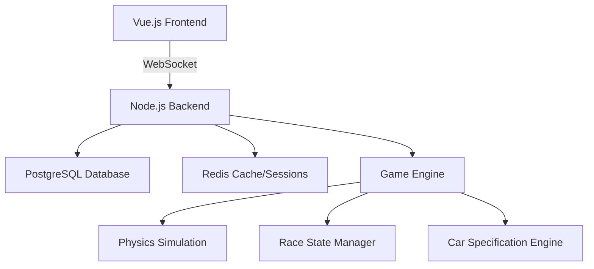

# Design Document

## Overview

The Text Racing MMO is a real-time, browser-based racing game that combines authentic car specifications with strategic text-based gameplay. The system uses a client-server architecture with WebSocket communication for real-time updates, PostgreSQL for persistent data storage, and Redis for session management and game state caching.

## Architecture

### High-Level Architecture



### System Components

- **Frontend (Vue.js)**: Single-page application handling user interface, command input, and real-time race visualization
- **Backend (Node.js)**: RESTful API and WebSocket server managing game logic, player sessions, and data persistence
- **Game Engine**: Core racing simulation handling physics, car performance, and race progression
- **Database Layer**: PostgreSQL for persistent storage, Redis for session management and real-time state

## Components and Interfaces

### Frontend Components

#### RaceInterface Component
- **Purpose**: Main racing interface displaying race status and accepting player commands
- **Key Methods**:
  - `sendCommand(command: string)`: Transmits player commands to backend
  - `updateRaceState(state: RaceState)`: Updates UI with latest race information
  - `displayRaceLog(events: RaceEvent[])`: Shows race event descriptions

#### CarSelection Component
- **Purpose**: Interface for selecting and viewing car specifications
- **Key Methods**:
  - `loadAvailableCars()`: Fetches available car models from API
  - `selectCar(carId: string)`: Assigns selected car to player
  - `displayCarSpecs(car: CarModel)`: Shows detailed car specifications

#### LeagueStandings Component
- **Purpose**: Displays current league positions and race history
- **Key Methods**:
  - `loadStandings()`: Retrieves current league table
  - `loadRaceHistory()`: Shows past race results

### Backend Services

#### RaceService
- **Purpose**: Manages race lifecycle and player participation
- **Key Methods**:
  - `createRace(trackId: string)`: Initializes new race session
  - `processPlayerCommand(playerId: string, command: Command)`: Handles player input
  - `updateRaceState()`: Advances race simulation by one tick
  - `broadcastUpdate(raceState: RaceState)`: Sends updates to all participants

#### CarService
- **Purpose**: Manages car specifications and performance calculations
- **Key Methods**:
  - `getAvailableCars()`: Returns list of selectable car models
  - `calculatePerformance(car: CarModel, conditions: RaceConditions)`: Computes car performance metrics
  - `applyWearAndTear(car: CarInstance, usage: UsageData)`: Updates tire and component wear

#### PlayerService
- **Purpose**: Handles player authentication, profiles, and statistics
- **Key Methods**:
  - `authenticatePlayer(credentials: LoginData)`: Validates player login
  - `updatePlayerStats(playerId: string, raceResult: RaceResult)`: Records race performance
  - `getPlayerProfile(playerId: string)`: Retrieves player information and history

### WebSocket Event Interface

```typescript
interface WebSocketEvents {
  // Client to Server
  'race:command': { command: string, parameters?: any }
  'race:join': { raceId: string }
  'race:leave': { raceId: string }
  
  // Server to Client
  'race:update': RaceState
  'race:event': RaceEvent
  'race:complete': RaceResult
  'error': { message: string, code: string }
}
```

## Data Models

### Core Data Structures

#### CarModel
```typescript
interface CarModel {
  id: string
  name: string
  manufacturer: string
  year: number
  specifications: {
    horsepower: number
    weight: number // kg
    dragCoefficient: number
    frontalArea: number // m²
    drivetrain: 'FWD' | 'RWD' | 'AWD'
    tireGrip: number // coefficient
    gearRatios: number[]
    aeroDownforce: number // kg at 100mph
    fuelEconomy: number // L/100km
    zeroToSixty: number // seconds
    topSpeed: number // km/h
  }
  licensing: {
    source: string
    validUntil: Date
    restrictions: string[]
  }
}
```

#### RaceState
```typescript
interface RaceState {
  raceId: string
  trackId: string
  currentLap: number
  totalLaps: number
  raceTime: number // seconds since start
  participants: ParticipantState[]
  raceEvents: RaceEvent[]
  weather: WeatherConditions
  trackConditions: TrackConditions
}

interface ParticipantState {
  playerId: string
  carId: string
  position: number
  lapTime: number
  totalTime: number
  fuel: number // percentage
  tireWear: {
    front: number // percentage
    rear: number
  }
  speed: number // km/h
  location: TrackPosition
  lastCommand: string
  commandTimestamp: number
}
```

#### RaceEvent
```typescript
interface RaceEvent {
  id: string
  timestamp: number
  type: 'overtake' | 'pit_stop' | 'incident' | 'lap_complete' | 'race_start' | 'race_finish'
  description: string
  involvedPlayers: string[]
  data?: any
}
```

### Database Schema

#### Players Table
- `id` (UUID, Primary Key)
- `username` (VARCHAR, Unique)
- `email` (VARCHAR, Unique)
- `created_at` (TIMESTAMP)
- `total_races` (INTEGER)
- `wins` (INTEGER)
- `league_points` (INTEGER)

#### Cars Table
- `id` (UUID, Primary Key)
- `name` (VARCHAR)
- `manufacturer` (VARCHAR)
- `year` (INTEGER)
- `specifications` (JSONB)
- `licensing_info` (JSONB)
- `is_active` (BOOLEAN)

#### Races Table
- `id` (UUID, Primary Key)
- `track_id` (UUID)
- `start_time` (TIMESTAMP)
- `end_time` (TIMESTAMP)
- `race_data` (JSONB)
- `results` (JSONB)

#### Race_Participants Table
- `race_id` (UUID, Foreign Key)
- `player_id` (UUID, Foreign Key)
- `car_id` (UUID, Foreign Key)
- `final_position` (INTEGER)
- `final_time` (INTEGER)
- `race_events` (JSONB)

## Error Handling

### Client-Side Error Handling
- **Connection Errors**: Automatic reconnection with exponential backoff
- **Command Validation**: Real-time validation before sending to server
- **State Synchronization**: Conflict resolution for out-of-sync race states
- **User Feedback**: Clear error messages for invalid commands or system issues

### Server-Side Error Handling
- **Race State Corruption**: Automatic state recovery from Redis backup
- **Database Connection Issues**: Connection pooling with retry logic
- **Invalid Commands**: Graceful rejection with descriptive error messages
- **Player Disconnection**: Temporary AI takeover or race pause mechanisms

### Error Recovery Strategies
- **Graceful Degradation**: Continue race with reduced functionality if non-critical systems fail
- **State Persistence**: Regular snapshots of race state for recovery
- **Rollback Capability**: Ability to revert to previous valid race state
- **Monitoring and Alerting**: Real-time system health monitoring

## Testing Strategy

### Unit Testing
- **Car Performance Calculations**: Verify physics and specification-based performance
- **Command Processing**: Test all race command validation and execution
- **Data Models**: Validate data structure integrity and relationships
- **Business Logic**: Test race rules, scoring, and league mechanics

### Integration Testing
- **WebSocket Communication**: Test real-time message flow between client and server
- **Database Operations**: Verify data persistence and retrieval accuracy
- **Race Simulation**: End-to-end race scenarios with multiple participants
- **API Endpoints**: Test all REST API functionality

### Performance Testing
- **Concurrent Users**: Test system behavior with multiple simultaneous races
- **Real-time Updates**: Measure latency and throughput of race state updates
- **Database Load**: Test performance under high read/write scenarios
- **Memory Usage**: Monitor memory consumption during extended race sessions

### User Acceptance Testing
- **Race Experience**: Validate that text-based racing feels engaging and responsive
- **Command Interface**: Ensure commands are intuitive and provide expected results
- **Strategic Depth**: Verify that tire/fuel management creates meaningful decisions
- **League Progression**: Test long-term engagement and competitive balance

### Automated Testing Pipeline
- **Continuous Integration**: Automated test execution on code changes
- **Race Simulation Bots**: Automated players for load testing and regression testing
- **Data Validation**: Automated checks for car specification accuracy and licensing compliance
- **Performance Benchmarks**: Automated performance regression detection